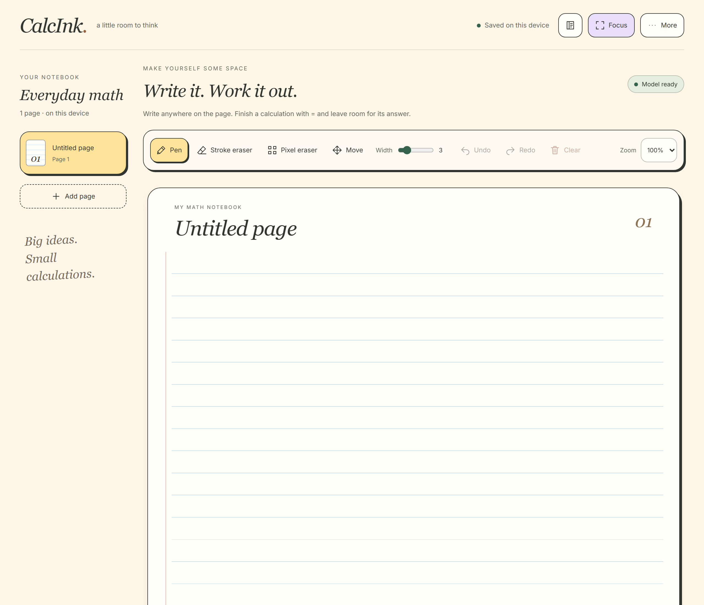
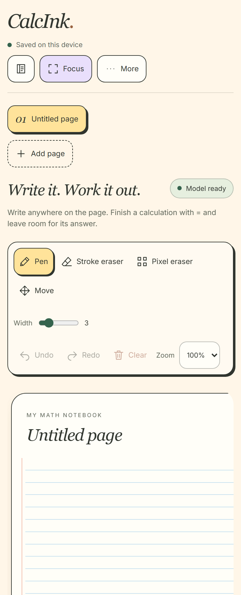

# CalcInk

A handwritten arithmetic notebook that runs entirely in your browser. Write an
expression, finish with `=`, and CalcInk uses a local ink-on CoMER INT8 model to
recognize it and calculate an inline answer.

**[Open the live app](https://kushagra905.github.io/CalcInk/)** ·
[Quick start](#quick-start) · [Commands](#command-reference) ·
[Architecture](docs/architecture.md)

Built for the Inter IIT Software Development Bootcamp with React, TypeScript,
Vite, Canvas 2D, ONNX Runtime Web and decimal.js.

- Continuous ruled pages with pen, whole-stroke erasing and pixel erasing.
- Inline arithmetic with precedence, decimals, unary signs, powers and undefined-result feedback.
- Up to 12 named pages, independent undo/redo, zoom, pan and focus mode.
- Local autosave, PNG export and whole-notebook JSON backup/restore.
- Offline use after the production app finishes preparing its verified files.
- On-device inference in a Web Worker; no account, API key or cloud recognition service.

## Quick start

Install **Git** and **Node.js 22.12 or newer** with npm. Node.js 24 is used in CI.
The initial dependency and model downloads need an internet connection.

```sh
git clone https://github.com/Kushagra905/CalcInk.git
cd CalcInk
npm ci
npm run assets:prepare
npm run dev
```

Open the URL printed by Vite, normally `http://127.0.0.1:5173/`. Wait for
**Model ready**, then write on the page. This starts **real recognition**.
`npm ci` installs the versions in `package-lock.json`; `assets:prepare` downloads
and verifies the pinned model files and copies the local WASM runtime.

**For drawing tests and sample collection:** use `npm run dev:mock` instead.
It uses fixed transcripts and shows a **Development mock** notice. Its answers
do not depend on what you draw. Mock mode is excluded from production builds.
Development servers do not provide the production offline cache.

## Screenshots

**Desktop:** page navigation, drawing tools and the continuous writing surface.



<details>
<summary><strong>Narrow screen:</strong> responsive navigation and toolbar</summary>



</details>

Captured from the production notebook after **Model ready** and **Ready
offline**. These show an empty notebook; the narrow view is browser emulation.
[Capture details and version](docs/screenshots/README.md).

## Using the notebook

1. Wait for **Model ready**. Write each calculation on its own line, finish with
   `=`, and leave space on the right for its answer. Nearby writing is grouped
   automatically; the paper rules are guides, not fixed input boxes.
2. Pause after writing. Recognition starts 350 ms after a completed edit.
   Editing or erasing clears the previous answer immediately, then recalculates.
3. If feedback says **Keep writing; finish with =**, complete the expression.
   For **Invalid expression** or **Could not read this; rewrite clearly**, check
   the notation or rewrite it. **Leave room after =** means the answer cannot fit.

The core handwriting symbols are digits `0–9`, `+`, `−`, `×`, `÷`, `.`, and terminal `=`.
The arithmetic parser also accepts `*`, `/` and parentheses, but handwritten
parentheses have not been validated. Power transcripts such as `4^2=`, `4^{2}=`,
and `4²=` calculate `16`; consecutive `==` or `= =` count as one completion marker.
A transcript of `42` remains forty-two; the app does not guess a missing exponent.
[Power implementation and regression](docs/power-fix.md).

Fractions, variables, graphs and two-dimensional equation layouts are outside the
current scope. Exact division by zero, `0^0`, and powers without a real-number
result display **Undefined**.

| Control | Action |
|---|---|
| **Pen / Width** | Draw; width changes apply to future strokes. |
| **Stroke eraser** | Remove whole visible strokes touched by the eraser. |
| **Pixel eraser / Eraser size** | Erase only the swept area; size is the brush diameter. |
| **Undo / Redo / Clear** | Edit the active page. Clear is undoable; each page keeps its own session history. |
| **Add page / page title** | Add a page or rename the current page by editing its title. |
| **Zoom / Move / Focus** | Magnify, scroll without drawing, or expand the writing area. |
| **More → Export page PNG** | Download the active page with its current ink and accepted answers. |
| **More → Download / Restore notebook backup** | Save or restore all pages as JSON. Restoring replaces the notebook after validation and, if it contains ink, confirmation. |

Keyboard shortcuts outside text fields: **Ctrl/Cmd+Z** for Undo,
**Ctrl/Cmd+Shift+Z** or **Ctrl+Y** for Redo.

### Saving and offline use

Completed edits and page titles save in this browser when the header says
**Saved on this device**. Reload restores saved ink and recomputes answers;
undo history starts fresh. Storage belongs to the browser profile and origin,
including its port. Download a JSON backup before clearing browser data or
moving devices. A second tab, or a browser without storage locking, uses
**Session only** editing; export that work to keep it.

Open the live app or a production preview online and wait for **Ready offline**
before disconnecting. That status requires verified cached files and an initialized
model. The app and model can then reload offline while the browser retains their
cache. Retry controls handle failed saving, model loading or offline preparation.

An available update requires explicit activation. Back up your work before
clearing ink on all pages to enable **Reload to update**; close other CalcInk tabs
before applying it. [Offline implementation](docs/phase-5.md).

## Production previews

For a production build served at `/`:

```sh
npm run build
npm run verify:production
npm run preview
```

Open the preview URL printed by Vite, normally `http://127.0.0.1:4173/`.
For the GitHub Pages path:

```sh
npm run build:pages
npm run preview -- --base /CalcInk/ --port 4174 --strictPort
```

Open `http://127.0.0.1:4174/CalcInk/`. Both builds replace `dist/`; use the
matching preview base. Prepared assets are required for either build.

## Checks

After installing dependencies:

```sh
npm run check
npm run test:unit
npm run test:assets
npx playwright install chromium
npm run test:e2e -- --workers=2
```

The default browser suite starts a mock development server and checks drawing,
erasers, history, saving and worker integration. Unit and default mock tests need
no model downloads. Stop previews on port 4173 before running this suite or
starting the lab preview. On Linux, use `npx playwright install --with-deps chromium`
when browser system libraries are missing.

To include real-model development tests, prepare assets and set
`CALCINK_MODEL_TEST=1` for `test:e2e`:

<details>
<summary>PowerShell and POSIX shell commands</summary>

```powershell
$env:CALCINK_MODEL_TEST = '1'
npm run test:e2e -- --workers=2
Remove-Item Env:\CALCINK_MODEL_TEST
```

```sh
CALCINK_MODEL_TEST=1 npm run test:e2e -- --workers=2
```

</details>

For production offline, performance and final-evaluator regressions:

```sh
npm run build:pages
npm run verify:production
npm run test:offline
npm run test:performance
npm run build:lab
npm run test:evaluation
```

These suites start their own preview servers; leave ports 4183 and 4193 free.
Performance checks include drawing during inference and 200 editing cycles and
take longer than unit tests. Automated synthetic ink tests check integration;
they do not measure genuine handwriting accuracy.

## Model lab and handwriting evaluation

`npm run dev:lab` opens the development lab at
`http://127.0.0.1:5173/tools/model-lab/`. Stop an existing server on port 5173 or
pass another port. Import development captures to inspect raw transcripts,
arithmetic outcomes and timing reports.

The guided collection in `dev:mock` collects **24 development samples** and
**50 separate held-out samples** from two writers. Keep held-out captures out of
development trials. [Capture workflow](docs/phase-1.md).

For the frozen final evaluator:

```sh
npm run build:lab
npm run preview:lab
```

Open `http://127.0.0.1:4173/tools/model-lab/final.html`, import the genuine held-out
exports, run evaluation and export its report. Verify against the same frozen
lab artifact; replace the example filename with your report path:

```sh
npm run phase6:report -- ./calcink-held-out-final-report.json --require-targets
```

The project targets are **at least 45/50 exact transcripts** and **warmed total-update
p95 ≤2 seconds** on the recorded device. Raw failures and arithmetic correctness
are reported separately. [Final evaluation instructions](docs/phase-6-recognition.md).

## Command reference

Run commands from the repository root. `--` forwards arguments to a script.

| Command | Purpose / prerequisite |
|---|---|
| `npm ci` | Install locked dependencies. |
| `npm run dev` | Real-model development notebook; prepare assets first. |
| `npm run dev:mock` | Fixed development fixtures and guided handwriting capture. |
| `npm run typecheck` | TypeScript checks only. |
| `npm run lint` | Biome lint checks only. |
| `npm run format:check` | Check formatting without writing files. |
| `npm run format` | Apply formatting. |
| `npm run check` | TypeScript plus Biome formatting/lint checks. |
| `npm run test:unit` | Run unit tests once. |
| `npm run test:watch` | Watch unit tests during development. |
| `npm run test:assets` | Test manifest integrity and runtime provenance. |
| `npm run test:e2e` | Development browser suite; install Chromium first. |
| `npm run test:offline` | Real-model offline/update/retry suite; build Pages first. |
| `npm run test:performance` | Production drawing/inference/resource measurements; build Pages first. |
| `npm run test:evaluation` | Final-evaluator browser/CLI regression; build the lab first. |
| `npm run test:public` | Public-site disconnected reload/inference checks; install Chromium and connect online initially. |
| `npm run assets:prepare` | Download/hash-check selected weights and copy the pinned local runtime. |
| `npm run assets:verify` | Verify prepared model/runtime files. |
| `npm run build` | Root-path production app and offline manifest → `dist/`. |
| `npm run build:pages` | `/CalcInk/` production app and offline manifest → `dist/`. |
| `npm run preview` | Serve `dist/` locally; match the build's base path. |
| `npm run verify:production` | Check mock exclusion in an existing production build. |
| `npm run verify:deployed -- https://kushagra905.github.io/CalcInk/` | Verify public build metadata and critical asset hashes. |
| `npm run dev:lab` | Development model lab. |
| `npm run build:lab` | Build and hash the evaluation artifact → `dist-lab/`; requires prepared assets. |
| `npm run preview:lab` | Serve the built lab. |
| `npm run benchmark:report -- ./development-report.json` | Validate/summarize an exported 24-sample development report. |
| `npm run phase6:report -- ./final-report.json --require-targets` | Verify a genuine final report and enforce targets; retain its original lab artifact. |

## How it works

Pointer events update immutable ink/history. A coordinator debounces edits and
sends current expression snapshots to one recognition worker. The worker crops
surviving ink, runs the selected **ink-on CoMER INT8** model through local WASM,
normalizes its transcript and evaluates strict arithmetic with decimal.js.
Revision checks discard stale replies. Accepted answers follow the writing and
scale to its height, using Comic Sans where available and bundled Inter as fallback.

| Directory | Responsibility |
|---|---|
| `src/app/`, `src/ink/`, `src/rendering/` | Controls, pointer capture, erasers and canvas rendering. |
| `src/document/` | Pages, immutable edits/history and IndexedDB persistence. |
| `src/recognition/`, `src/math/` | Scheduling, worker/model adapters, normalization and arithmetic. |
| `src/offline/`, `scripts/`, `assets/` | Verified model/runtime assets, offline caching and build/report tools. |
| `tools/model-lab/`, `tests/`, `docs/` | Capture/evaluation tooling, regressions and detailed project records. |

Generated model files, runtime copies, `node_modules/`, `dist/`, `dist-lab/` and
test output stay out of Git. Model/runtime provenance and retained licenses are
in [model attribution](docs/model-attribution.md). The TrOCR adapter is present
but blocked by unresolved weight-license evidence; it is not the selected model.

## Deployment and current status

GitHub Pages uses **Settings → Pages → Source: GitHub Actions**. A push to `main`
runs **CalcInk Pages**, builds and tests the artifact, deploys it, then verifies
public hashes and disconnected browser inference. Branches and pull requests run
checks without publishing. Open the app through the live link above or the
repository's **Deployments → github-pages** environment.

The product implementation and automated checks are integrated. Recorded genuine
handwriting accuracy, physical mouse/touch/stylus acceptance, a genuine public
offline demonstration and joint release sign-off remain pending. Browser automation
covers Chromium/Edge; other browsers and physical devices need recorded results.

Further details: [architecture](docs/architecture.md),
[notebook design](docs/notebook-redesign.md),
[measured performance](docs/performance.md), and the
[remaining release checklist](docs/release-checklist.md).
