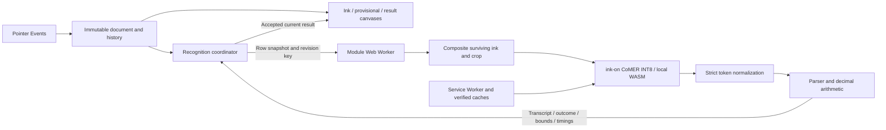

# CalcInk architecture

## Product and constraints

CalcInk is a static browser notebook with up to twelve continuous ruled pages. Users can write across the whole page; nearby strokes are grouped internally for single-line arithmetic recognition. Canvas ink, recognition, decimal arithmetic, local notebook saving and offline asset handling execute on the user's device. GitHub Pages serves static files; there is no application server, account system or cloud recognition request.

Required handwritten symbols are digits `0-9`, `+`, minus, multiplication, division, decimal point and terminal equals. Parentheses are accepted by the arithmetic parser but are not an established handwriting capability. Fractions, variables, powers, graphs and arbitrary two-dimensional layouts are outside this release.

## Runtime flow

React owns controls, progress and readable result/error state. Imperative Canvas 2D code owns drawing. The recognition worker owns rasterization, model inference and arithmetic. The service worker owns versioned file delivery; it is separate from the recognition worker.

## Document and drawing

- `src/document/rows.ts` defines a 960 x 1280 logical page, 40-unit decorative ruling and 32 internal expression identities. Its original row positions remain development capture anchors, not clipping regions or visible sections. Rendering, pointer conversion and model crops use page coordinates. Paper rules and margins never enter recognition input.
- `src/document/store.ts` owns immutable ink operations, edit events, monotonically increasing row revisions and document epoch. Undo/redo restores geometry but never restores an old revision identity. Clear is undoable; reset releases history.
- `src/app/Notebook.tsx` captures one pointer, converts CSS coordinates to logical page coordinates, handles cancellation and replays after size/DPR changes. Coalesced events and animation-frame batching support smooth drawing.
- `src/ink/replay.ts`, `geometry.ts` and `eraser.ts` share curve replay, bounds and visible-stroke hit testing. Whole-stroke erase removes a visible stroke; pixel erase appends a `destination-out` mask affecting only preceding ink. Later strokes remain visible.
- The live page caps operations/points, and history retains at most 100 commands. At capacity the app preserves ink and keeps recovery tools available.

`src/ink/groups.ts` associates a new stroke with vertically nearby writing or an unused expression identity. Every point is clamped only to the outside edge of the page. Erasers can sweep all groups; `commitRows` validates all replacements atomically and records one undo command. `src/rendering/replay.ts` isolates each group's masks on a reused bitmap bounded around its ink, so an old mask cannot erase a later stroke in another group. Feedback and answers follow actual ink bounds, rather than fixed row positions.

`src/document/notebooks.ts` owns page titles and independent page stores behind a stable document facade. Switching pages advances a global epoch and publishes fresh row snapshots, invalidating late replies from another page while retaining one recognition worker. Restored documents validate operations, points, row identities and limits before replacing the collection. Answers are recomputed and session undo history starts fresh.

`src/document/persistence.ts` saves completed edits and metadata to IndexedDB after 500 ms. A Web Lock permits one writer per origin; another tab remains exportable session-only. Failed writes expose retry without dropping ink, and invalid saved data is never overwritten automatically. Held-out collection pauses ordinary notebook saving and page management. Local data depends on the browser profile and origin; it is not cloud synchronization.

`src/app/App.tsx` provides page navigation, focus, zoom, tools and backup restoration. `export.ts` composites PNG exports from captured ink/result snapshots; JSON backups preserve all pages and validated operations. CSS supplies the ruled paper and light comic theme. Inter 400 is bundled in the artifact under OFL, and Georgia Italic uses the system font. Font readiness triggers answer layout. On narrow screens the paper scrolls horizontally at a minimum 480 CSS pixels, keeping strokes and answers aligned.

## Recognition and arithmetic

`src/recognition/connect.ts` connects the document to `coordinator.ts` and `trial-client.ts`. Completed edits wait 350 ms. There is one active inference and at most one latest pending snapshot per row. Starting an edit clears the old answer immediately. Cancellation, erase, clear and history operations use the same invalidation path.

The nested protocol in `protocol.ts` carries epoch, row ID/revision, request ID and model ID. The coordinator/client accept results only when every identity matches. Late errors and stale results cannot restore an obsolete answer. A ten-second inference timeout permits one worker restart; repeated failures expose retry while retaining ink. Failed or disposed workers terminate rather than accumulating sessions.

`trial-worker.ts` selects the adapter and evaluates its raw transcript. `rasterize.ts` replays each group's composited surviving ink inside its actual vertical extent, computes alpha bounds and crops with a 16-unit margin. Crossing a former row boundary no longer truncates input. The ink-on adapter converts alpha to a white-on-black float input, preserves aspect ratio, uses height 256 and padded widths that are multiples of 64 up to 1024. Masks accompany valid image content. Preprocessing is isolated inside the adapter.

`adapters/ink-on.ts` selects the pinned CoMER INT8 encoder/decoder and vocabulary, uses beam width 3 and bounded output, and explicitly configures local single-threaded ONNX Runtime Web WASM. Hash-bearing model URLs prevent an older upstream IndexedDB entry being reused for changed weights. TrOCR's separate adapter remains blocked until its weight-license evidence is resolved; it is not a silent runtime fallback.

`normalize.ts` accepts known mathematical typography/spacing and collapses consecutive equals signs into one completion marker, including equals separated only by supported spacing. It does not insert missing tokens. Separate equals positions, such as `1=2=`, remain invalid. Raw recognition text is retained for benchmark evidence. `src/math/evaluate.ts`, `lexer.ts`, `parser.ts`, `evaluator.ts` and `format.ts` enforce arithmetic grammar and decimal calculation. One terminal equals completes an expression. Outcomes distinguish answer, incomplete, invalid, unrecognized and exact division by zero (`Undefined`).

`src/rendering/results.ts` places an accepted answer after surviving ink, reduces its font size when necessary and asks for more space if it would overlap. Raw text remains available in evaluation reports; readable canonical text is separate.

## Assets, offline and updates

`assets/model-candidates.json` is the selected-model/revision/file/license source of truth. `scripts/model-assets.mjs` downloads immutable sources, checks exact size/SHA-256 and copies runtime files from locked installed packages. `asset-manifest.mjs` verifies the model/runtime manifest. Generated weights/runtime/builds are ignored by Git.

`offline-build.mjs` verifies the emitted artifact, includes model attribution/license, generates `offline-manifest.json` and a content-derived service worker version, and enforces the deployment size ceiling. Vite's `/CalcInk/` Pages base controls URLs and scope.

`src/offline/client.ts` and `scripts/service-worker.js` coordinate shell caching, critical file verification, retry and updates. **Ready offline** requires both verified caches and successful real model initialization. Missing/corrupt files and quota failures remain recoverable. Initial preparation needs connectivity. Updates wait for explicit activation; ink on any page, an active gesture or another app tab blocks unsafe reload. Saved notebook ink restores locally on reload; unsaved/session-only ink and undo history remain tab-scoped.

## Tests and delivery

- Vitest covers document/history, geometry, strict arithmetic, scheduling, lifecycle and final-report validation. Node asset tests verify provenance and corruption handling.
- Playwright development tests exercise capture and interaction; explicit real-model tests verify WASM compatibility. Prefixed production tests cover offline/update/retry behavior.
- Performance tests measure drawing during inference and 200 editing cycles; resource observations have the scope documented in `performance.md`.
- The separate frozen final evaluator uses the real store/coordinator/model and verifies 50 genuine held-out samples. Synthetic test fixtures are never accuracy evidence.
- `.github/workflows/ci.yml` checks locked install, code/assets, browsers and built artifacts. `pages.yml` deploys the tested main artifact, then checks its public version/hashes and disconnected synthetic inference. Only the deployment job has publishing permissions.

The final quality gate is recorded in [the release checklist](release-checklist.md). Genuine recognition targets are >=45/50 exact canonical transcripts and warmed p95 total update <=2 seconds on the named device. These are project engineering targets. Physical-device results, genuine offline arithmetic and final developer sign-off remain unverified until recorded.
